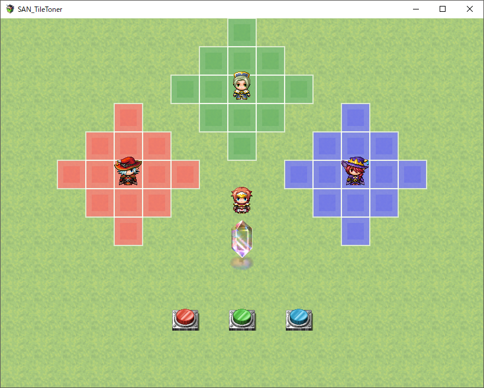

# SAN_TileToner
このスクリプトはRPGツクールMV向けプラグインです。

## 概要
スクリプトコマンドによってマップのタイルを染色します。
染色したタイルには波紋のようなアニメーションを表示します。
RGBとアルファ値の設定が可能です。

## 使い方
次のリンク先のファイルを保存してプラグインとして適用してください。
https://raw.githubusercontent.com/rev2nym/SAN_TileToner/master/js/plugins/SAN_TileToner.js   
詳細はプラグイン内のヘルプとサンプルプロジェクトを参考にしてください。   

## サンプルプロジェクト
次のダウンロードリンクからzipファイルをダウンロードして展開後に
新規プロジェクトに上書き保存してください。  
https://github.com/rev2nym/SAN_TileToner/archive/master.zip

## デモ
- 画像
   

- Twitterリンク（動画）  
[デモ1](https://twitter.com/rev2nym/status/940064561364795393)  
[デモ2](https://twitter.com/rev2nym/status/810519679299186688)  

## 利用規約
MITライセンスのもと、商用利用、改変、再配布が可能です。
ただし冒頭のコメントは削除や改変をしないでください。
これを利用したことによるいかなる損害にも作者は責任を負いません。
サポートは期待しないでください＞＜。
